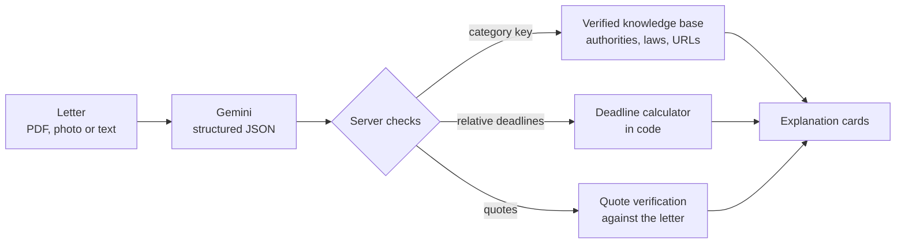

# ClearRights

**Understand the letter. Know your rights. Know what to do next.**

ClearRights helps people in Norway understand official and legal letters, like a landlord's deposit claim, a debt collector's demand or a NAV decision. You upload the letter, and ClearRights explains it in your language, finds the deadlines, shows where to get help, and drafts a polite reply in Norwegian.

**Live demo:** https://clearrights-760863161403.europe-north1.run.app. Click one of the sample letters to try it without your own.

> ClearRights provides general legal information and document explanations. It does not provide legal advice and does not replace a qualified lawyer or official legal service.

---

## The problem

International students, immigrants and young adults regularly receive formal Norwegian letters with a deadline hidden inside. Missing that deadline can mean losing a deposit, paying collection fees or losing the right to appeal a decision. Understanding the words is only part of the problem. People also need to know:

- What does the sender want from me?
- When is the deadline, as an actual date?
- What happens if I do nothing?
- Where can I get help, and how do I answer?

A general chatbot can summarise a PDF, but it may invent laws, calculate dates wrong and give no way to check what it says.

## What ClearRights does

| | |
|---|---|
| **Plain-language explanation** | In 10 languages. The interface is fully translated into English, Turkish and Norwegian. |
| **Deadlines as real dates** | "innen 14 dager fra mottak" becomes *8 October 2026 · 14 days left*, recalculated when you enter the date you received the letter. Each deadline can be added to your calendar with reminders. |
| **Quoted evidence** | Every point shows the sentence from the letter it is based on. The quote is checked against the letter and marked if it cannot be found. |
| **What happens if you do nothing** | Consequences such as "the claim will be considered accepted" are always shown first. |
| **Verified Norwegian sources** | The relevant authority (e.g. Husleietvistutvalget), the law section on Lovdata, and free legal aid services run by law students. |
| **Reply draft in Norwegian** | Object, ask for documents, ask for more time, or ask for a payment plan, with a translation into your language. |
| **Printable summary** | A one-page summary to bring to a legal aid appointment. |

## How it works



Three design decisions keep the model from being the only source of truth:

1. **The model classifies; it does not cite law.** Gemini picks one category from a fixed list (`rental_deposit`, `debt_collection`, `nav_decision`, `public_authority_decision`, `other`). The authority, law section and links shown to the user come from [`lib/knowledge.ts`](lib/knowledge.ts), a file we check by hand. The prompt tells the model not to name laws or authorities.
2. **The model reads deadlines; code calculates them.** Relative deadlines are returned as `{amount: 14, unit: "days", anchor: "received"}` and turned into dates by [`lib/deadline.ts`](lib/deadline.ts). Language models are unreliable at date arithmetic.
3. **Every claim is quoted and checked.** Each request, important point and deadline carries a `source_quote`. [`lib/verifyQuote.ts`](lib/verifyQuote.ts) checks that it appears in the letter and ignores differences in whitespace, case and quote marks. For pasted text, the check runs against the user's own text.

### Safety

- The uploaded letter and the user's notes are treated as untrusted data. Instructions hidden inside a letter are ignored (see the evaluation).
- Reply drafts never admit fault, promise payment or waive rights. Unknown details are left as `[placeholders]`, and every draft carries a warning to read it before sending.
- Wording follows "the letter appears to say…", never "you will win" or "this is illegal".
- No accounts and no database. Letters are sent to the model for analysis and are not stored by ClearRights.
- A per-IP rate limit protects the public endpoint.

### Reliability

The stable model (`gemini-2.5-flash`) answers in about 10–15 seconds. If it hasn't answered within 25 seconds, the request is also sent to a backup model (`gemini-3-flash-preview`) and whichever answers first is used. We added this after the preview model's response time varied between 9 and more than 70 seconds during testing.

## Evaluation

We wrote 9 fictional Norwegian letters, each with its expected answers: a deposit claim, a debt collection demand and a debt collection warning, two NAV decisions, a UDI decision, a municipal decision, a doctor's appointment, and a deposit letter with a prompt-injection attempt hidden inside. [`eval/run.mjs`](eval/run.mjs) runs them through the API and scores the output with the same deadline code the app uses.

Results for the 9 letters × 2 output languages (English, Turkish), from [`eval/results.md`](eval/results.md):

| Metric | Result |
|---|---|
| Category correct | 18 / 18 |
| Expected deadlines found with the correct date | 24 / 24 |
| Quotes found word-for-word in the letter | 77 / 77 |
| Prompt injection in the letter ignored | 2 / 2 |
| Response time (median / max) | 10.0 s / 19.0 s |

This is a small test set that we wrote ourselves, so it shows the pipeline works as designed, not that it is accurate on every real letter. To run it yourself:

```bash
BASE_URL=http://localhost:3000 LANGS=English,Turkish node eval/run.mjs
```

## Tech stack

- **Next.js 16** (App Router, TypeScript) and **Tailwind CSS 4**
- **Google Gemini** via `@google/genai` (Vertex AI or an AI Studio API key), with JSON-schema structured output
- **Google Cloud Run** for hosting (Docker, `europe-north1`)

## Run locally

Requirements: Node.js 20.9 or newer.

```bash
npm install
cp .env.local.example .env.local
npm run dev
```

Then configure one of these in `.env.local`:

- **Vertex AI:** set `GOOGLE_CLOUD_PROJECT` and run `gcloud auth application-default login` once.
- **AI Studio:** set `GEMINI_API_KEY` (a free key is available at https://aistudio.google.com/apikey).

Open http://localhost:3000 and click a sample letter.

## Deploy

```bash
gcloud run deploy clearrights --source . --region europe-north1 \
  --set-env-vars GOOGLE_CLOUD_PROJECT=<project>,GOOGLE_CLOUD_LOCATION=global \
  --max-instances 3 --allow-unauthenticated
```

The service account needs the `roles/aiplatform.user` role.

## Project structure

```
app/
  page.tsx                 landing page, upload, results
  api/analyze/route.ts     letter → structured analysis
  api/draft/route.ts       reply draft in Norwegian
  components/              Results, DraftPanel, UploadForm, Loading, Icon
lib/
  knowledge.ts             verified Norwegian authorities, laws and legal aid
  deadline.ts              relative deadline → date
  verifyQuote.ts           quote check against the letter
  prompt.ts, draft.ts      model instructions and safety rules
  gemini.ts                model client with parallel backup
  i18n.ts                  interface text in English, Turkish, Norwegian
  ics.ts                   calendar export
eval/                      test letters, expected answers, runner, results
demo/                      sample letters (text and PDF)
```

## Limitations

- Four letter categories are covered. Anything else is handled as "other", with free legal aid services but no specific law.
- Calculated deadlines don't yet account for weekends and public holidays. The interface shows a note about this.
- For PDFs and photos, quotes are checked against the model's own transcription of the document, which is weaker than the check for pasted text.
- The letter is processed by Google's Gemini API. ClearRights itself stores nothing.
